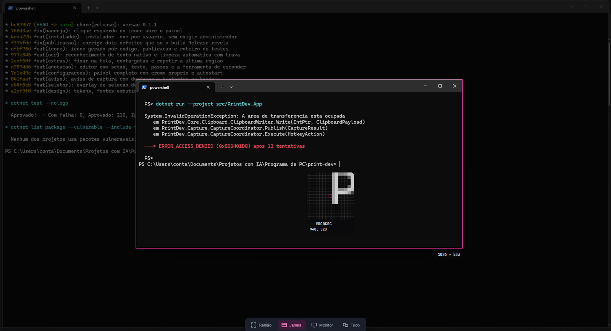
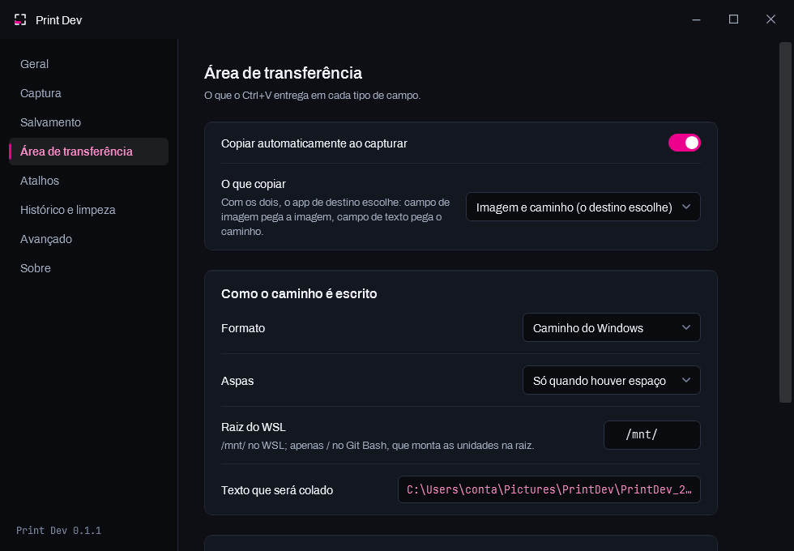
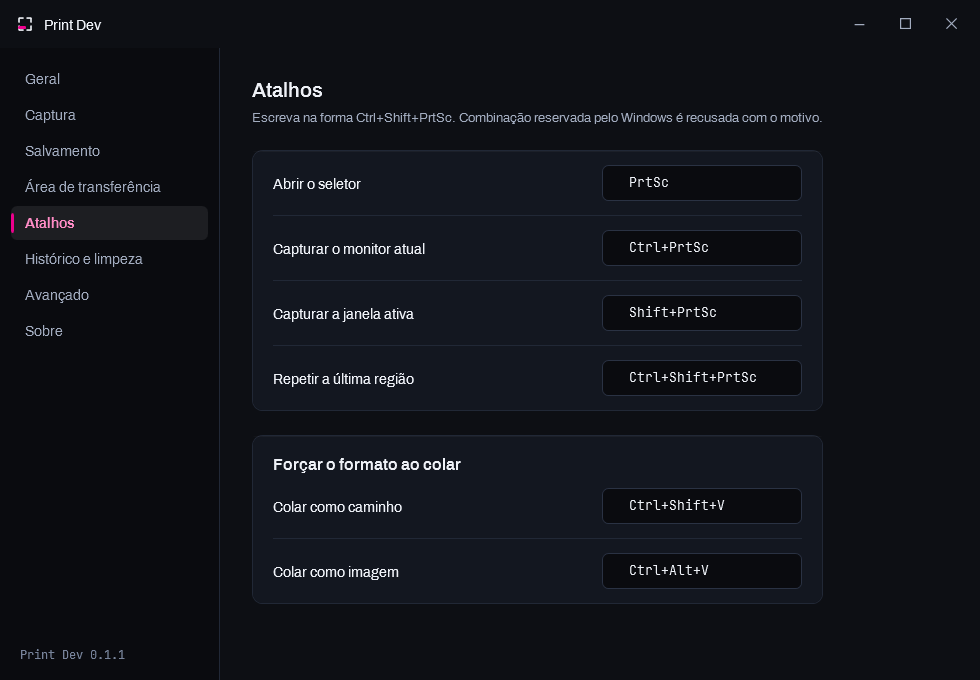
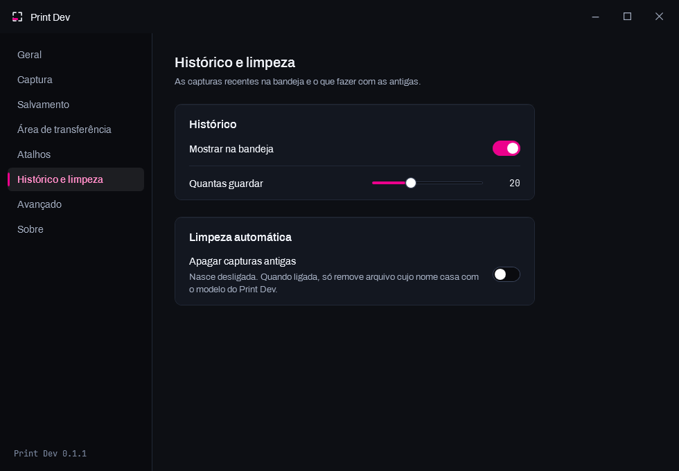
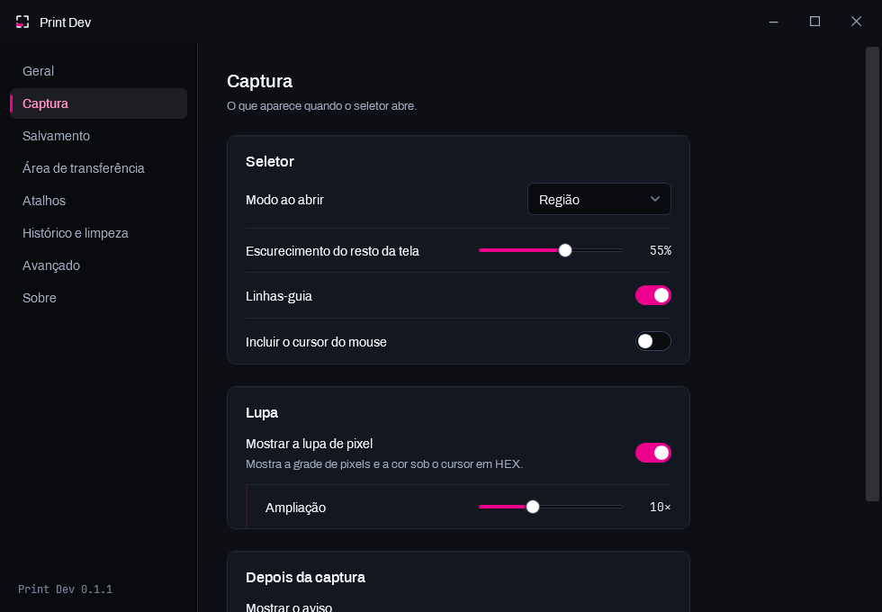
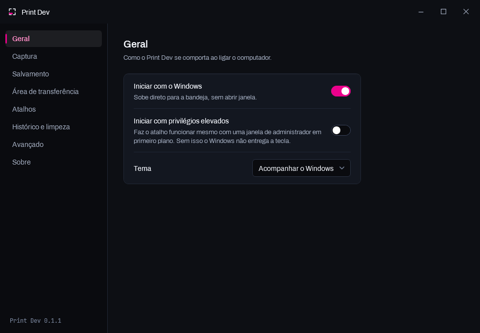

<div align="center">

# Print Dev

**Capturador de tela para quem programa.**
Uma captura, um `Ctrl+V`, e o destino certo recebe o que sabe consumir.

[](LICENSE)
[](https://github.com/marreiradigital/print-dev/releases/latest)
[](https://github.com/marreiradigital/print-dev/releases)
[](#requisitos)

### [**⬇ Baixar**](https://printdev.marreira.dev) · [Site](https://printdev.marreira.dev) · [Versões](https://github.com/marreiradigital/print-dev/releases) · [Sugerir algo](https://github.com/marreiradigital/print-dev/issues/new)

</div>



---

## O problema

A Ferramenta de Captura do Windows entrega a imagem na área de transferência e para por aí.
Quem programa precisa das **duas** coisas, e quase nunca da mesma vez:

- a **imagem**, para colar no WhatsApp Web, num *issue*, num prompt de IA;
- o **caminho do arquivo**, para colar num terminal, num campo de texto, num ``.

Hoje isso obriga a salvar na mão, achar a pasta e copiar o caminho. Três passos para uma
coisa só.

## A ideia: um `Ctrl+V` que acerta sozinho

> Campo que aceita imagem (WhatsApp Web, Word, Figma, Discord) recebe **a imagem**.
> Campo que só aceita texto (terminal, `textarea`, editor de código) recebe **o caminho**.
> Sem escolher nada, sem salvar na mão, sem caçar a pasta.

O arquivo é **sempre** gravado em disco antes de ir para a área de transferência — mesmo
quando você só queria copiar.

<div align="center">



</div>

## Instalar

Baixe o instalador da [última versão](https://github.com/marreiradigital/print-dev/releases/latest)
e execute. Leva menos de um minuto.

| | |
|---|---|
| **Não pede administrador** | Instala em `%LOCALAPPDATA%\Programs\PrintDev` |
| **Windows vai avisar** | O instalador não é assinado digitalmente. Clique em *Mais informações → Executar assim mesmo* |
| **Iniciar com o Windows** | Vem marcado: um capturador que não está rodando não serve para nada |
| **Suas capturas nunca são apagadas** | Nem pelo desinstalador, que pergunta só sobre configurações e logs |

### Requisitos

| Item | Versão |
|---|---|
| Windows | 10 build 19041 (2004) ou superior · desenvolvido no Windows 11 25H2 |
| .NET Runtime | `Microsoft.WindowsDesktop.App` 8.0 — o instalador avisa se faltar |

## Atalhos

<div align="center">



</div>

| Atalho padrão | Ação |
|---|---|
| `PrtSc` | Abre o seletor de área |
| `Ctrl+PrtSc` | Captura o monitor sob o cursor |
| `Shift+PrtSc` | Captura a janela em primeiro plano |
| `Ctrl+Shift+PrtSc` | Repete o último recorte, na mesma posição |
| `Ctrl+Shift+V` | Cola a última captura como **caminho** |
| `Ctrl+Alt+V` | Cola a última captura como **imagem** |
| `Ctrl+Alt+P` | Conta-gotas de cor |
| `Ctrl+Alt+T` | Recorta e copia o texto reconhecido |

Todos configuráveis, e mudar vale na hora. Escreva na forma `Ctrl+Shift+PrtSc` — as
grafias usuais são aceitas (`PrintScreen`, `Print`, `Esc`/`Escape`, `PgUp`, setas em
português), sem diferenciar maiúsculas. Combinação que o Windows reserva (`Win+L`,
`Win+Shift+S`, `Ctrl+Alt+Del`, `Win+Tab`) é recusada **com o motivo escrito**, em vez de
aceita e silenciosamente inútil.

### Quando outro programa está com a tecla

O `PrtSc` é a tecla mais disputada do Windows: Lightshot, ShareX, Greenshot, Snagit,
PicPick e até o OneDrive a registram, e quem chega primeiro fica com ela.

O Print Dev **nomeia o culpado** no log em vez de dizer apenas que falhou, e continua
tentando a cada 30 segundos — então fechar o concorrente na mão já basta, sem reiniciar
nada. O comportamento é escolhido em `avancado.aoDetectarConcorrente`:

| Valor | O que faz |
|---|---|
| `perguntar` (padrão) | Registra o conflito nomeando o programa e segue tentando reaver |
| `assumirAutomaticamente` | Encerra o concorrente e assume a tecla |
| `somenteAvisar` | Só registra; não tenta encerrar nada |

O padrão não é `assumirAutomaticamente` porque encerrar processo alheio é destrutivo
demais para acontecer sem o usuário ter pedido.

---

## O seletor de área

`PrtSc` congela a tela e abre o seletor sobre **todos os monitores**. Arraste para
recortar; solte e a captura já está salva e na área de transferência.

| Gesto | O que faz |
|---|---|
| Arrastar | Recorta a região |
| Clique simples | Captura a janela sob o cursor |
| `Tab` ou `1` `2` `3` `4` | Troca entre Região, Janela, Monitor e Tudo |
| Setas | Movem a seleção 1 px · com `Shift`, 10 px · com `Ctrl`, redimensionam |
| Roda do mouse | Ajusta a ampliação da lupa |
| `Enter` | Confirma · `Esc` limpa a seleção e, sem seleção, cancela |
| Botão direito | Cancela |

A lupa mostra a grade de pixels, marca a célula exata sob o cursor e lê a cor em HEX
junto com a coordenada.

### Por que uma janela por monitor

Uma única janela cobrindo tudo teria dois problemas insolúveis: seria escalada pelo fator
de um monitor só, deformando lupa, badge e barra no outro; e pintaria por cima dos
**buracos do desktop virtual**, que existem de verdade quando as telas têm alturas
diferentes. Com uma janela por monitor, cada uma desenha só a interseção da seleção com a
própria tela — a moldura corta sozinha na borda e não aparece no vazio.

O estado da seleção é compartilhado e vive em **pixels físicos**, e a posição do cursor
vem sempre do Windows, nunca do evento do WPF: durante um arrasto que saiu da janela de
origem, as coordenadas do evento ficam negativas ou maiores que o monitor. É isso que faz
arrastar de uma tela para a outra funcionar sem nenhum caso especial.

## Depois da captura

Um aviso aparece no canto do **monitor onde a captura aconteceu** — não sempre na tela
principal, porque quem capturou no monitor secundário está olhando para ele. Traz a
miniatura, o nome do arquivo, as dimensões e as ações:

| Ação | O que faz |
|---|---|
| **Copiar caminho** | Troca a área de transferência por só o caminho, em texto |
| **Anotar** | Abre o editor de anotação |
| **Desfazer** | Manda o arquivo para a **Lixeira** e tira do histórico |

Passar o mouse por cima segura o aviso: quem foi ler o nome do arquivo não pode vê-lo
fugir no meio da leitura. Botão direito dispensa na hora.

É uma janela própria, e não o balão do Windows — que é feio, chega atrasado, some sem
aviso, pode estar desligado por política de grupo e não aceitaria essas ações.

O **Desfazer** manda para a Lixeira, e não para o nada: desfazer é reversível por
definição, então quem clicou errado precisa poder voltar atrás do voltar atrás.

### Histórico

O menu da bandeja tem **Capturas recentes**, com miniatura de cada uma. Clicar recopia —
e a imagem vem do arquivo em disco, não da miniatura, porque guardar vinte capturas de
tela cheia em memória passaria de cem megabytes.

## Anotar e esconder

| Ferramenta | Tecla |
|---|---|
| Seta · Retângulo · Elipse · Caneta | `1` `2` `3` `4` |
| Marca-texto · Texto · Numeração de passos | `5` `6` `7` |
| **Esconder** | `8` |
| Desfazer · Refazer | `Ctrl+Z` · `Ctrl+Y` |
| Copiar e fechar | `Ctrl+Enter` · `Esc` cancela |

O modelo é vetorial: desfazer é remover o último item da lista, não guardar uma cópia da
imagem por traço — em captura de tela cheia isso custaria oito megabytes por marca.

### A ferramenta de esconder

É o motivo de o produto existir para quem programa: token, chave de API, e-mail de
cliente e nome de banco aparecem em captura de tela o tempo todo.

**A operação é destrutiva de propósito.** Desenhar um retângulo por cima esconde na tela e
não esconde no arquivo — qualquer editor separa as camadas de novo. Aqui os bytes
originais deixam de existir, e é isso que o aviso na barra promete.

| Estilo | Quando usar |
|---|---|
| **Pixelar** (padrão) | Comunica melhor: o texto some, mas continua visível que *havia* algo ali |
| Tarja sólida | Quando nem a existência do conteúdo deve aparecer |
| Desfocar | O menos seguro dos três — com raio pequeno, texto desfocado pode ser recuperado |

Na barra ela fica **isolada entre dois divisores** e é a única ferramenta que não usa a
cor de acento quando ativa: recebe hachura diagonal, visual de área censurada. Não pode
parecer mais um ícone na fila.

## Fixar, conta-gotas e repetir

**Fixar na tela** deixa a captura flutuando sempre por cima. Arraste para mover, roda
amplia, **`Ctrl`+roda dá transparência** — com a captura semitransparente por cima do que
está sendo feito, a diferença entre os dois salta aos olhos. `Ctrl+0` volta ao tamanho e à
opacidade originais; `Esc` ou botão direito fecha.

**Conta-gotas** (`Ctrl+Alt+P`) congela a tela e mostra só a lupa — **sem véu**, porque
escurecer a tela falsearia justamente a cor que se está medindo. Clique copia no formato
escolhido: `#ec008c`, `rgb(236, 0, 140)`, `hsl(324, 100%, 46%)` ou `0xEC008C`.

**Repetir a última região** (`Ctrl+Shift+PrtSc`) captura de novo o mesmo retângulo. Serve
para acompanhar algo que muda dentro da mesma área — um erro no terminal, uma compilação,
um contador. Sem isso, cada repetição obriga a mirar de novo e nunca sai igual.

## Reconhecer texto (OCR)

`Ctrl+Alt+T` recorta uma área e copia o **texto** que estiver nela. Usa o motor que já vem
no Windows: sem dependência externa, **sem rede** — para uma ferramenta que captura tela,
onde passa senha, código e dado de cliente, mandar a imagem para um serviço na nuvem seria
a decisão errada por mais conveniente que fosse.

O caso de uso é copiar a mensagem de erro que está numa imagem — print de log, captura de
terminal de outra máquina, foto de tela mandada por alguém — para colar num prompt ou numa
busca. Redigitar um rastreamento de pilha à mão é exatamente o trabalho que este atalho
apaga.

Cada linha reconhecida vira uma linha no texto: juntar tudo num parágrafo destruiria a
estrutura de um log ou de um trecho de código, que é o que mais se captura. Se nada for
reconhecido, **a imagem é entregue mesmo assim** — perder o recorte porque o motor não
achou texto seria o pior desfecho.

Precisa do pacote de idioma com reconhecimento óptico instalado. Sem ele, o programa diz
exatamente onde ativá-lo em vez de falhar em silêncio.

## Limpeza automática

<div align="center">



</div>

Nasce **desligada**. É a única parte do programa que apaga arquivo do usuário, e por isso
é a mais desconfiada:

- só olha dentro da pasta configurada;
- só reconhece arquivo cujo **nome casa com o modelo** do Print Dev — apontar a pasta de
  capturas para uma pasta que já tem coisa sua não põe os seus arquivos em risco;
- **nunca atravessa link simbólico**, o que faria a varredura sair da pasta sem ninguém
  perceber;
- manda para a **Lixeira**;
- e tem o botão **Simular limpeza**, que lista o que seria removido sem tocar em nada.

A expressão que reconhece os nossos arquivos tem teste dedicado, com uma lista de nomes
que **não** podem casar. Um falso positivo ali significa apagar arquivo que você criou.

---

## Como o `Ctrl+V` acerta sozinho

Nenhum programa consegue saber para onde você vai colar. O que resolve isso é publicar
**vários formatos numa transação só**, na ordem certa — o programa de destino pega o
primeiro que sabe consumir.

Ordem publicada em cada captura:

| # | Formato | Quem consome |
|---|---|---|
| 1 | `PNG` (registrado por nome) | **Chromium procura este primeiro** — WhatsApp Web, Discord, Slack, Figma, todo app Electron |
| 2 | `CF_DIBV5` | Bitmap com canal alfa: Word, OneNote, editores de imagem |
| 3 | `CF_DIB` | Bitmap clássico, para quem não lê os anteriores |
| 4 | `CF_HDROP` + `Preferred DropEffect` + `FileNameW` | Explorador do Windows *(desligado por padrão)* |
| 5 | `CF_UNICODETEXT` | **O caminho do arquivo** — terminal, `textarea`, editor de código |

O texto vai por último de propósito: é o que sobra para quem não entende imagem. Campo de
imagem nunca chega nele, porque encontra um formato de imagem antes.

`CF_BITMAP`, `CF_TEXT`, `CF_OEMTEXT` e `CF_LOCALE` aparecem depois na lista — são
**sintetizados pelo próprio Windows** a partir dos que publicamos, e por isso não entram
na conta.

### Três armadilhas que decidiram o projeto

- **O canal alfa zerado.** O `BitBlt` grava zero no byte de alfa de cada pixel, e zero
  significa "totalmente transparente". Publicado como `CF_DIBV5`, isso faria a imagem
  colada aparecer como um retângulo preto em todo programa que respeita o canal. A
  captura força alfa 255 na origem.
- **A ordem das linhas.** Os bitmaps vão de baixo para cima (altura positiva). De cima
  para baixo é mal suportado e aparece invertido em vários programas.
- **O formato HTML fica de fora.** Em campo de texto rico o Chromium prefere HTML à
  imagem, e uma marcação apontando para o disco local cola **imagem quebrada**. É opção
  desligada, não esquecimento.

### Forçar um formato

`Ctrl+Shift+V` cola o caminho; `Ctrl+Alt+V` cola a imagem. Os dois republicam a última
captura no formato pedido e mandam o colar — soltando antes os modificadores que você
ainda está segurando, senão o destino receberia `Ctrl+Shift+V` em vez de `Ctrl+V`.

---

## Configurações

<div align="center">



</div>

Abre com um **clique no ícone da bandeja**, pelo menu do botão direito, por
`PrintDev.exe --configuracoes`, ou simplesmente abrindo o programa de novo. Oito seções:
Geral, Captura, Salvamento, Área de transferência, Atalhos, Histórico e limpeza, Avançado
e Sobre.

**Não há botão OK.** A mudança vale na hora e a gravação em disco é adiada meio segundo —
arrastar um controle deslizante dispara dezenas de mudanças por segundo e não pode virar
dezenas de gravações. Também não existe cópia intermediária das configurações, e por isso
não existe o estado "o painel mostra uma coisa e o arquivo tem outra".

Duas prévias ao vivo, porque escolher às cegas é o que faz configuração virar tentativa e
erro: **como o nome do arquivo vai ficar** e **o texto exato que será colado**.

### Editando o arquivo à mão

Ficam em `%APPDATA%\PrintDev\settings.json`, com as chaves em português — o arquivo é
feito para ser editado à mão. O programa **relê sozinho** quando o arquivo muda: salvar no
editor já vale, sem reiniciar nada.

| Seção | Para quê |
|---|---|
| `geral` | Iniciar com o Windows, iniciar elevado, tema |
| `captura` | Modo padrão do seletor, escurecimento, lupa, cursor, atraso, aviso |
| `salvamento` | Pasta, subpasta por data, formato, qualidade JPEG, modelo de nome |
| `areaDeTransferencia` | O que copiar e como o caminho é escrito ao ser colado como texto |
| `atalhos` | Combinações de teclas globais |
| `anotacao` | Cor, espessura e estilo de ocultação |
| `historico` · `limpeza` | Capturas recentes e remoção automática das antigas |
| `avancado` | Nível de log, política ao detectar outro capturador |

Três padrões que são decisão consciente, não esquecimento:

- **`incluirArquivo` e `incluirHtml` nascem desligados.** São os dois formatos de área de
  transferência que causam efeito colateral em programa de terceiro — o `CF_HDROP` faz o
  Outlook anexar em vez de embutir a imagem, e o HTML faz o Chromium preferir uma marcação
  que aponta para o disco local e colar imagem quebrada.
- **`limpeza.ativa` nasce desligada**, e quando ligada só remove arquivo cujo nome casa
  com o modelo do Print Dev, mandando para a Lixeira.
- **`aoDetectarConcorrente` é `perguntar`.** Encerrar processo alheio é destrutivo demais
  para acontecer em silêncio, mesmo sendo o que resolve o conflito de atalho.

Arquivo inválido não impede o programa de subir: ele é renomeado para
`settings.corrompido-<data>.json`, os padrões entram no lugar e o motivo vai para o log.
Chave que este código não conhece é preservada na regravação, então uma versão mais nova
não perde configuração ao ser aberta por uma mais antiga.

### Iniciar com o Windows

<div align="center">



</div>

| Modo | Como funciona |
|---|---|
| Normal | Entrada em `HKCU\…\Run`. Sem privilégio nenhum, e visível no Gerenciador de Tarefas |
| **Elevado** | Tarefa no Agendador com gatilho de logon e privilégio mais alto |

O modo elevado existe por um motivo concreto: o Windows **não entrega o atalho global** a
um processo de integridade mais baixa que a janela em foco. Sem ele, o `PrtSc` não
funciona com o Gerenciador de Tarefas, o `regedit` ou um instalador em primeiro plano.

Criar a tarefa exige privilégio, então o programa se relança elevado **uma vez só**;
depois disso ela sobe sozinha, sem prompt de UAC no logon. Os dois modos são mutuamente
exclusivos — manter os dois abriria o programa duas vezes.

---

## Design

Nada de visual nativo do Windows. A direção é **Marca de Corte** — a linguagem de prova
de gráfica, que não é referência decorativa: um screenshot é literalmente um corte com
registro. O elemento-assinatura são os colchetes de canto, que aparecem só onde
significam *"isto é uma área recortável"*: as alças do seletor, o anel de foco, o ícone
do app.

O acento é **`#EC008C`, o magenta de registro**, e a escolha é técnica:

| Cor | vs. branco | vs. preto |
|---|---|---|
| **`#EC008C` magenta** | **4,25:1** | **4,94:1** |
| âmbar `#FFB020` | 1,9:1 ❌ | 11,6:1 |
| verde-limão `#C8F751` | 1,9:1 ❌ | 15,8:1 |

É a única família de matiz equilibrada contra os dois extremos **e** a cor mais rara no
conteúdo que um dev captura — onde quase tudo é azul, cinza, branco e preto. O retângulo
de seleção precisa aparecer por cima de qualquer coisa.

**Tipografia:** [Archivo](https://github.com/Omnibus-Type/Archivo) e
[JetBrains Mono](https://github.com/JetBrains/JetBrainsMono), ambas OFL 1.1, embutidas no
executável. Todo número que muda em tempo real — coordenada, dimensão, HEX — vai em mono:
é tabular por construção, então o badge de dimensão não fica tremendo a cada pixel
arrastado.

**Espaçamento:** nada pode ficar colado. Os valores vivem em tokens semânticos
(`Gap.LabelToControl`, `Gap.FieldToField`…), e o espaço é responsabilidade do contêiner —
existe um `Stack` próprio com propriedade de espaçamento, porque o `StackPanel` do WPF
não tem uma. Ele também **pula filhos recolhidos**, que é o que evita o buraco fantasma
onde um ajuste condicional está escondido.

Tema escuro e claro completos, trocáveis em tempo de execução e capazes de acompanhar o
Windows. O tema claro não é o escuro clareado: a hierarquia se inverte, a camada de estado
troca de sinal e as cores semânticas escurecem para terem contraste sobre branco.

---

## Para quem for compilar

### Requisitos

.NET SDK 8.0. Nada além disso — o restante vem do NuGet no primeiro `restore`.

### Rodar

```powershell
dotnet build
dotnet test
dotnet run --project src/PrintDev.App
```

> **Encerre o programa antes de compilar.** Com ele rodando, o executável fica travado e o
> build falha na cópia — com o erro perdido no meio da saída, o que já custou duas
> correções que "não entraram".

### Estrutura

| Projeto | Papel |
|---|---|
| [`src/PrintDev.Core`](src/PrintDev.Core) | Domínio, serviços, Win32/WinRT. Sem WPF. |
| [`src/PrintDev.App`](src/PrintDev.App) | WPF: bandeja, overlay, painel de configurações, composition root. |
| [`tests/PrintDev.Tests`](tests/PrintDev.Tests) | xUnit sobre a lógica pura do Core. |

Documentação profunda em [`docs/`](docs): as
[decisões de arquitetura](docs/decisoes-de-arquitetura.md) e o
[roteiro de testes manuais](docs/roteiro-de-testes-manuais.md) — o que a suíte automatizada
não consegue provar (atalho global, geometria entre monitores, e o que cada programa faz
ao receber um `Ctrl+V`).

### Argumentos de linha de comando

| Argumento | O que faz |
|---|---|
| `--silencioso` (`-s`, `/silencioso`, `--tray`) | Sobe direto para a bandeja, sem janela. É o que o autostart usa. |
| `--configuracoes` | Abre o painel de configurações ao subir. |

### Gerar o instalador

```powershell
powershell -ExecutionPolicy Bypass -File scripts\gerar-instalador.ps1
```

Precisa do Inno Setup: `winget install --id JRSoftware.InnoSetup --exact`

O script publica **antes** de compilar, de propósito: compilar o instalador sozinho
empacotaria a publicação anterior — um instalador com o programa velho dentro, que compila
sem erro e só aparece como "a correção não entrou" muito depois.

### Publicar sem instalador

```powershell
# dia a dia — a máquina já tem o runtime instalado (~6 MB)
dotnet publish src/PrintDev.App -c Release -r win-x64 --self-contained false `
  -p:PublishSingleFile=true -p:PublishReadyToRun=true

# para levar a outra máquina, sem depender de runtime (~170 MB)
dotnet publish src/PrintDev.App -c Release -r win-x64 --self-contained true `
  -p:PublishSingleFile=true -p:IncludeNativeLibrariesForSelfExtract=true `
  -p:PublishReadyToRun=true
```

`PublishTrimmed` e NativeAOT são **bloqueados pelo SDK para WPF** — a interface depende de
reflexão sobre o XAML compilado. `PublishReadyToRun` é compatível e melhora o arranque
frio.

O ícone é **gerado por código** (`scripts/gerar-icone.ps1`), com oito resoluções e uma
escada de simplificação: em 16 e 20 pixels a tarja magenta viraria uma mancha, então
nesses tamanhos ficam só os quatro colchetes, mais grossos.

### Qualidade

- **Auditoria de dependência no próprio `restore`**: `NuGetAudit` com `AuditMode=all` e
  `AuditLevel=low` no [`Directory.Build.props`](Directory.Build.props). Pacote vulnerável —
  inclusive transitivo — quebra o build. Estado atual: **0 vulnerabilidades**.
- **210 testes** na lógica pura: formatação de caminho, matemática de seleção com os
  *bounds* reais de uma topologia de dois monitores desalinhados, modelo de nome,
  ida-e-volta das configurações, e os testes de seleção da limpeza — os mais críticos,
  porque um falso positivo ali apaga arquivo do usuário.
- **Arquivos `.cs` e `.xaml` em UTF-8 com BOM** ([`.editorconfig`](.editorconfig)). A
  interface é toda em português acentuado; sem o BOM, um build ou editor pode ler o
  arquivo como ANSI e corromper o texto.
- **`TreatWarningsAsErrors` em Release.**

---

## Solução de problemas

**O ícone não apareceu na bandeja.** Ele apareceu — o Windows 11 esconde todo ícone novo
no menu de estouro (a setinha `^` ao lado do relógio). Para fixá-lo na barra, arraste-o de
dentro do estouro para a área do relógio, ou vá em *Configurações do Windows →
Personalização → Barra de tarefas → Outros ícones da bandeja do sistema* e ligue o Print
Dev.

**Abri o programa de novo e nada aconteceu.** Só existe uma instância por sessão. A
segunda avisa a primeira, que abre o painel de configurações, e encerra. O registro fica
no log (`%APPDATA%\PrintDev\logs\`).

**O `PrtSc` não faz nada.** Provavelmente outro capturador está com a tecla. O log nomeia
qual — feche-o e o Print Dev reassume em até 30 segundos, sem reiniciar.

**A captura saiu preta.** Conteúdo protegido (Netflix, Prime) e janelas marcadas para
excluir de captura vêm pretas por decisão do Windows, não por defeito do programa. O aviso
diz isso quando detecta um quadro inteiramente preto.

---

## Alvos futuros

Documentados para não virarem surpresa, mas **ainda não implementados**:

- **Captura com rolagem** está fora do escopo. A implementação honesta exige UI
  Automation, vários quadros e costura por casamento de imagem — é a funcionalidade com
  mais defeitos abertos nos concorrentes. Para página web inteira, o DevTools do navegador
  resolve melhor (*Capture full size screenshot*).
- **Detecção automática de segredos** só existirá com confirmação humana. Uma ferramenta
  que promete borrar credencial sozinha e falha uma vez faz o usuário vazar a chave
  confiando nela.
- **Envio para a nuvem** está fora por privacidade: justamente a captura que costuma ter
  segredo.

---

## Como contribuir

**Sugestões são muito bem-vindas — em [issues](https://github.com/marreiradigital/print-dev/issues).**
Abra uma para relatar defeito, pedir funcionalidade ou discutir uma decisão. Quanto mais
concreto o relato (versão, o que você esperava, o que aconteceu, o log em
`%APPDATA%\PrintDev\logs\`), mais rápido vira correção.

A licença **não permite distribuir versões modificadas**, então *pull requests* de código
não são aceitos. Não é falta de vontade: é o que mantém "Print Dev" significando uma coisa
só para quem baixa.

## Licença

**[Creative Commons Atribuição-SemDerivações 4.0 Internacional (CC BY-ND 4.0)](LICENSE)**

| Você pode | Você precisa | Você não pode |
|---|---|---|
| Usar de graça, para sempre | Dar crédito ao autor | Distribuir versão modificada |
| Usar no trabalho, inclusive comercialmente | Indicar se houve mudanças | Remover ou esconder a autoria |
| Compartilhar o instalador e o link | Linkar a licença | Aplicar medidas que impeçam o permitido pela licença |

Fez um *fork* aqui no GitHub? Tudo bem — mas o crédito tem que ficar visível:

> Print Dev, de **Paulo Marreira** — <https://marreira.dev>
> Licenciado sob CC BY-ND 4.0.

O texto que vale é o da [LICENSE](LICENSE); a tabela acima é só um resumo em português.

## Créditos

<div align="center">

Feito por **[Paulo Marreira](https://marreira.dev)**

[**marreira.dev**](https://marreira.dev) · [github.com/marreiradigital](https://github.com/marreiradigital)

</div>

Bibliotecas de terceiros, todas de licença permissiva:
[Hardcodet.NotifyIcon.Wpf](https://github.com/hardcodet/wpf-notifyicon) (MIT) ·
[CommunityToolkit.Mvvm](https://github.com/CommunityToolkit/dotnet) (MIT) ·
[Serilog](https://serilog.net) (Apache-2.0) ·
[Archivo](https://github.com/Omnibus-Type/Archivo) e
[JetBrains Mono](https://github.com/JetBrains/JetBrainsMono) (OFL 1.1) ·
ícones de [Lucide](https://lucide.dev) (ISC).
